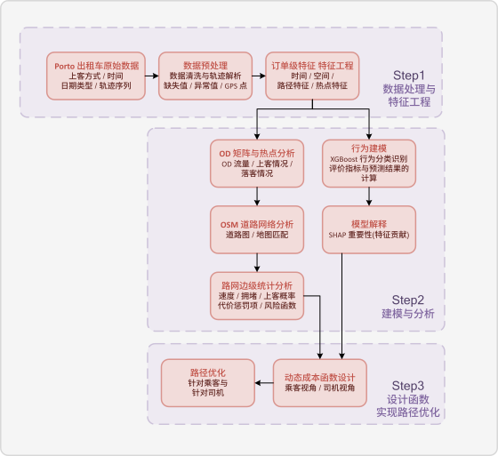
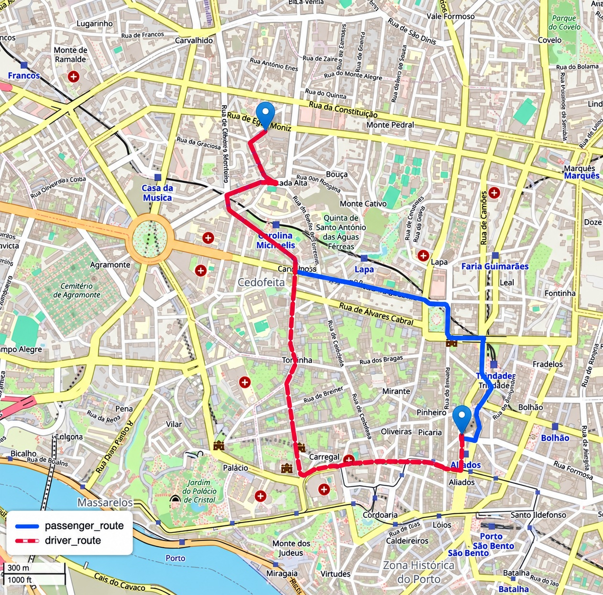

# 基於出租車軌跡數據的出行模式識別與動態路徑優化研究

## 語言

[**繁體中文**](./README.md) | [**English**](./README.en.md) | [**Tiếng Việt**](./README.vi.md)

## 概要

本專案以葡萄牙波尔图市（英語/葡萄牙語：Porto）出租車軌跡為研究對象，探討如何從車輛的移動過程中識別出行模式，並將城市需求與道路通行狀態納入路徑規劃。透過可解釋的統計建模，刻畫城市出行需求與道路運行狀態，並分別從乘客的通行效率與司機的潛在接單機會出發，探索不同目標下的路徑選擇。研究沿著「**軌跡描述 → 模式識別 → 需求分析 → 路徑最佳化**」展開：首先將離散定位點轉化為可分析的行程描述，再辨識不同上客方式的出行特徵，進一步刻畫需求在時間與空間上的分布，最後建立乘客與司機兩種視角的路徑選擇模型。

**關鍵詞：** 出行模式識別｜城市需求分析｜動態路徑優化

📄 [**此处閱讀完整參賽論文**](202602077-完整论文.pdf)

## 儲存庫結構

```text
.
├── README.md
├── LICENSE
├── 202602077-完整论文.pdf     # 參賽論文
├── ds_code/                  # 建模程式碼
├── outputs/                  # 分析輸出
└── images/                   # 論文與專案圖片
```

## 研究框架

出租車軌跡同時包含行程、需求與路網三個層面的資訊：

- **行程層面：** 一次出行如何發生、持續多久，以及沿途如何移動。
- **需求層面：** 出行從哪裡產生、流向何處，以及如何隨時段變化。
- **路網層面：** 車輛經過哪些道路，各道路具有怎樣的通行條件與上客機會。

這三個層面彼此銜接。行程描述為模式識別提供依據，起終點分布形成城市需求結構，道路上的歷史運行資訊則支援路徑成本的建構。



*由軌跡分析延伸至出行模式識別與路徑最佳化的研究流程。*

## 軌跡描述與出行模式識別

### 從定位點到行程描述

原始軌跡是一組按時間排列的定位點。要分析出行行為，需要將這些點轉化為具有明確意義的行程描述，例如移動距離、持續時間、平均速度及路徑形態。

設一段軌跡包含 $n$ 個定位點，相鄰點的採樣間隔為 $\Delta t$，以 $d_H$ 表示球面距離，則行程時長與累計距離可表示為：

$$D=(n-1)\Delta t,\qquad L=\sum_{j=1}^{n-1}d_H(p_j,p_{j+1}),\qquad V=\frac{L}{D}.$$

距離與時間描述行程規模，路徑形態則補充移動方式的差異。例如，同樣的起終點可能對應不同的繞行程度；相近的行程距離，也可能因道路條件而具有不同的通行時間。因此，出行行為需要從多個角度共同描述。

### 出行模式的機率識別

本研究將電話叫車、站點上客與路邊上客視為不同的出行模式。識別問題的核心，是利用行程的時間、空間與移動形態，估計其屬於各種模式的機率。

設 $x$ 為行程描述，$f_k(x)$ 為模型對第 $k$ 類模式的評分，則可透過 Softmax 將評分轉化為機率：

$$\Pr(y=k\mid x)=\frac{\exp(f_k(x))}{\sum_{\ell=1}^{K}\exp(f_\ell(x))},\qquad \hat y=\arg\max_{1\leq k\leq K}\Pr(y=k\mid x).$$

這一建模方式允許多種資訊共同影響判斷，也能描述非線性關係。例如，時間與位置可能共同影響上客方式，單獨考察其中一項不足以解釋完整的出行模式。

### 模型解釋

模式識別除了回答「屬於哪一類」，還需要說明「哪些資訊影響了判斷」。本研究採用 SHAP 的加性解釋思路，將一次預測分解為基準輸出與各項資訊的貢獻：

$$f(x)=\phi_0+\sum_{j=1}^{m}\phi_j.$$

其中，$\phi_0$ 表示基準輸出，$\phi_j$ 表示第 $j$ 項資訊對預測的貢獻。這種分解有助於理解模型如何綜合不同資訊，但其揭示的是模型中的統計關係，不能直接視為因果關係。

## 城市需求的時空結構

### OD 流向

起點與終點的聯繫構成 OD 關係。將研究區域劃分为空間單元，並按時段聚合行程，可以建立分時段 OD 矩陣：

$$F_{ab}^{(r)}=\sum_{i=1}^{N}\mathbf{1}\{g_i^o=a,\ g_i^d=b,\ t_i\in r\}.$$

其中，$F_{ab}^{(r)}$ 表示時段 $r$ 內從區域 $a$ 前往區域 $b$ 的出行量，$g_i^o$ 與 $g_i^d$ 分別表示第 $i$ 次出行的起點與終點區域。

OD 矩陣同時保留需求的位置與流向，因此既能描述區域之間的聯繫，也能比較這些聯繫如何隨時段變化。

### 上客與落客熱點

對 OD 矩陣分別沿終點與起點方向加總，可得到各區域的出發量與到達量：

$$O_a^{(r)}=\sum_bF_{ab}^{(r)},\qquad M_b^{(r)}=\sum_aF_{ab}^{(r)}.$$

出發量刻畫上客需求的集中程度，到達量刻畫目的地的吸引程度。兩者具有不同的含義：大量行程到達某區域，並不必然意味著該區域同時具有較多的上客需求。

分時段分析進一步保留需求的時間差異，使後續路徑規劃能夠考慮出發時段所對應的需求環境。

## 道路狀態與需求機會

路徑規劃需要將行程層面的資訊轉化為道路層面的描述。將軌跡與道路網路建立對應後，可以按時段估計道路通行時間、擁堵程度及上客機會。

### 擁堵程度

道路擁堵程度可透過歷史通行時間與自由流通行時間的比值描述：

$$q_e^{(r)}=\frac{\tau_e^{(r)}}{\tau_e^0+\varepsilon}.$$

其中，$\tau_e^{(r)}$ 為道路 $e$ 在時段 $r$ 的歷史估計通行時間，$\tau_e^0$ 為自由流通行時間，$\varepsilon$ 為避免數值問題的小正數。

這一比值描述道路相對於自由流狀態的通行延遲，使路徑選擇能夠考慮不同道路與時段的運行差異。


*道路擁堵程度的空間表達*

### 上客機會

道路附近的上客機會可由歷史上客次數與道路訪問次數的比例近似描述：

$$p_e^{+(r)}=\frac{N_{e,+}^{(r)}}{N_e^{(r)}+\varepsilon}.$$

其中，$N_{e,+}^{(r)}$ 表示道路附近的上客起始次數，$N_e^{(r)}$ 表示道路的歷史訪問次數。

這一指標為司機的路徑選擇提供需求依據。由於歷史觀測量會影響估計的穩定性，上客機會需要與通行成本共同考量。


*道路上客機會的空間表達*

## 雙視角動態路徑最佳化

### 乘客視角

乘客的路徑選擇主要關注到達目的地的通行成本。距離、時間、擁堵與道路風險共同影響行程體驗，因此需要將不同因素轉化為可比較的尺度，再組合成道路成本。

這種複合成本允許路徑在多個目標之間取得平衡。例如，較短的道路可能具有較高的擁堵成本，適度繞行則可能改善通行效率。

### 司機視角

司機除了關注移動成本，也關注沿途的潛在接單機會。因此，司機側的道路評價需要同時考慮通行代價與需求收益。

需求較高的道路可能值得付出一定的額外移動成本，但需求機會也需要受到距離、時間與擁堵的約束。路徑選擇由此形成通行成本與潛在收益之間的權衡。

### 路徑求解

將道路網路表示為圖，設 $\mathcal{P}(o,d)$ 為起點 $o$ 至終點 $d$ 的可行路徑集合，$C_{e,p}^{(r)}$ 與 $C_{e,d}^{(r)}$ 分別為乘客與司機視角下的道路成本，則兩種路徑規劃可統一表示為：

$$P_p^*=\arg\min_{P\in\mathcal{P}(o,d)}\sum_{e\in P}C_{e,p}^{(r)},\qquad P_d^*=\arg\min_{P\in\mathcal{P}(o,d)}\sum_{e\in P}C_{e,d}^{(r)}.$$

兩種視角使用相同的道路網路，但對道路價值的評估不同，因此可能選擇不同的路徑。由於目標函數不同，兩者的綜合成本數值不宜直接比較優劣。

此處的「動態」體現在道路成本隨時段變化：同一段道路在不同時段可能具有不同的通行條件與需求機會，因而改變整條路徑的選擇。這一框架以歷史分時段資訊為基礎。



*藍色為乘客視角路徑，紅色為司機視角路徑。*

## 作者與授權

完整研究內容請參閱 [《基于出租车轨迹数据的出行模式识别与动态路径优化研究》](202602077-完整论文.pdf)。本專案的使用與再散布條件請參閱 [`LICENSE`](LICENSE)；外部資料與地圖資源應依各自的授權條款使用。

**Copyright &copy; 2026 [何非凡 (HE Feifan; HÀ Phi Phàm)](https://faculty.lzjtu.edu.cn/chenmei/zh_CN/xsxx/2554/content/1835.htm)、[杜宇 (DU Yu; ĐỖ Vũ)](https://faculty.lzjtu.edu.cn/chenmei/zh_CN/xsxx/2554/content/1837.htm)、閆媛媛 (YAN Yuanyuan; DIÊM Viện Viện)。指導教師：[陳梅教授 (Prof. CHEN Mei; GS. TRẦN Mai)](https://faculty.lzjtu.edu.cn/chenmei/zh_CN/index/2541/list/index.htm), 蘭州交通大學電子與信息工程學院**
